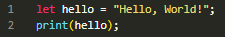
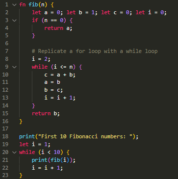
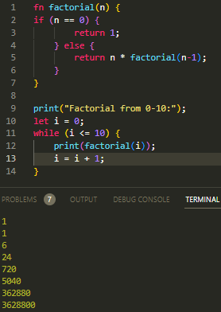

<!-- Title for the project -->
# Demi - Programming Language

## Version: 0.0.3-alpha

<!-- Badges -->

<!-- Project mini description -->
Demi is an interpreted programming language currently written in TypeScript. It is a dynamically typed language with a syntax similar to JavaScript. It is a work in progress and is not yet ready for use. I have plans to port it to C++ in the future set it up as an llvm compiled language.

<!-- How to install -->
## How to install

1. Clone the repository
2. Install Deno ([Deno Installation](https://deno.land/manual@v1.35.2/getting_started/installation))
3. Run the compile command:
   - Linux/MacOS: `./compile.sh [windows|linux|macos]`
   - Windows: `.\compile.ps1 [windows|linux|macos]`
4. Run the executable:
   - Linux/MacOS: `./demi`
   - Windows: `.\demi.exe`

<!-- How to use -->
## How to use

Demi is an interpreted language, so it can be run in a REPL or by passing a file to the executable. The REPL can be started by running the executable without any arguments. To run a file, pass the path to the file as an argument to the executable.

<!-- Examples -->
## Examples

### Hello World

> Output: `Hello World!`

### Fibonacci

> Output: `1 1 2 3 5 8 13 21 34`

### Factorial

## License

This project is licensed under the MIT License - see the [LICENSE](LICENSE) file for details

## Contributing

If you would like to contribute to this project, please read the [CONTRIBUTING](CONTRIBUTING.md) file for more information.

## Other Tools

[Demi-SyntaxHighlighting](https://marketplace.visualstudio.com/items?itemName=bobrossrtx.demi-syntax)
Demi-SyntaxHighlighting is a Visual Studio Code extension that adds syntax highlighting for Demi files.
